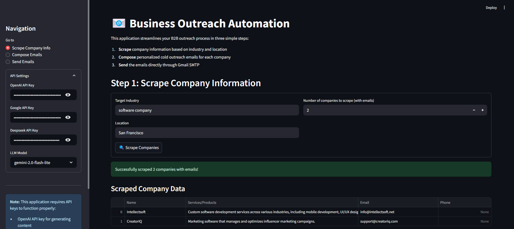
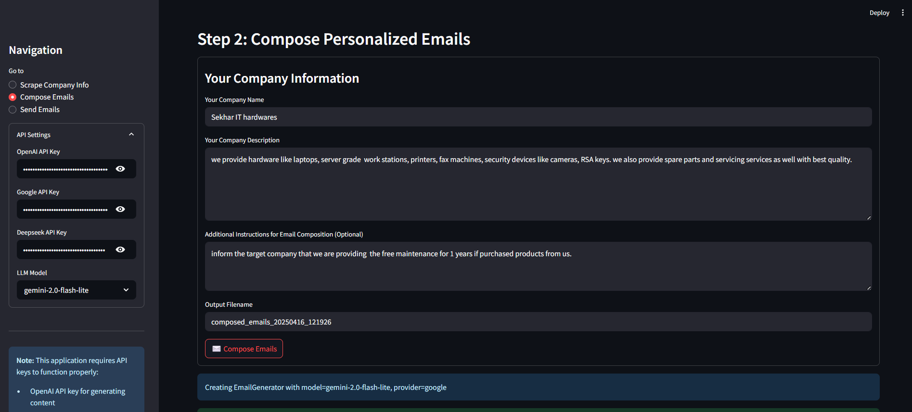
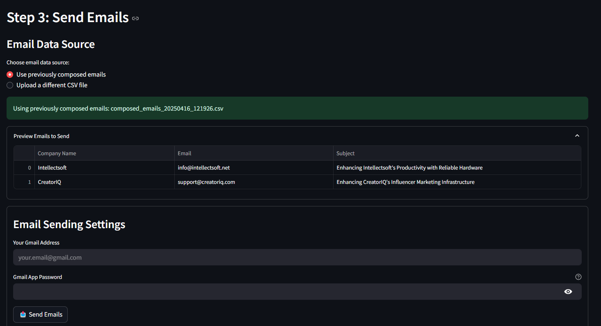

# ColdMailer-AI: AI-Powered Business Outreach Automation

## 📂 About this Project
This Streamlit application automates business outreach by scraping company emails from a target industry in a specific locality using advanced AI and Web scraping techniques, generating tailored emails using an LLM model, and sending them using your Gmail account. It is accurate, modular, user-friendly, and efficient.

## 📌 Introduction
This documentation covers everything you need to get started with and run the Streamlit application, including installation, usage steps with screenshots, setting environment variables, and launching the app.

## 🚀 How to Use
Follow these three steps to use the app:

Before starting:
- Select your preferred LLM model from the side panel.
    - Use any lightweight LLM like **gpt-4o-mini** or **gemini-2.0-flash-lite** for the web scraping pipeline to reduce token cost without impacting accuracy. The workflow is optimized to run well with smaller models.
    - You can switch to an **OpenAI** model (recommended) in Step 2 for composing emails, as they generate more natural, human-like text.
- Provide the relevant API key for the selected model provider in the side panel.

### 1️⃣ Step 1 - Scrape Target Companies
- Enter the target industry name, location, and number of company emails to scrape.
- Click the **Scrape Emails** button.
- The app will display company name, email, phone (optional), and a brief about their offerings.



### 2️⃣ Step 2 - Compose Personalized Emails
- Click **Step 2** in the side panel.
- Enter your company name, your offerings, and instructions for how to personalize the email.
- Click **Compose Emails**.
- Personalized emails will be shown on the UI for each target company.



### 3️⃣ Step 3 - Send Emails
- Click **Step 3** in the side panel.
- Enter your Gmail address and Google App Password.
- [Learn how to create a Google App Password](https://support.google.com/accounts/answer/185833?hl=en).
- Emails will be sent to the scraped contacts.



## 🔐 Set Environment Variables
The app uses a `.env` file. You can populate it as follows:

```env
PSE_API_KEY=""
PSE_ENGINE_ID=""
DEEPSEEK_API_KEY="" 
OPENAI_API_KEY=""
GOOGLE_AI_API_KEY=""
SENDER_EMAIL=""
GOOGLE_APP_PASSWORD=""
```

💡 Only one LLM API provider key is required based on the model you choose.

### 📌 How to Get PSE API Key and Engine ID
- **PSE** stands for Programmable Search Engine by Google.
- Go to [Programmable Search Engine](https://programmablesearchengine.google.com/about/) and create a new search engine.
- You’ll get an **Engine ID** after setup.
- To get an API key, visit the [Google Cloud Console](https://console.cloud.google.com/), create a project, enable the Custom Search API, and generate an API key under **APIs & Services > Credentials**.
- Both are free to use with limited quota.

## 📦 Installation
1. Clone the repository:
```bash
git clone https://github.com/MrMunio/ColdMailer-AI.git
cd ColdMailer-AI
```

2. Create and activate a virtual environment (optional but recommended):
```bash
python -m venv venv
source venv/bin/activate  # On Windows: venv\Scripts\activate
```

3. Install dependencies:
```bash
pip install -r requirements.txt
```

## ▶️ Run the Streamlit App
Run the app using:
```bash
streamlit run app.py
```

Replace `app.py` with your main Streamlit script if named differently.

---

📄 **Note**: Ensure Python 3.8+ and Streamlit are installed:
```bash
pip install streamlit
```

🎯 You're all set! Open the link from the terminal to use the app in your browser.

